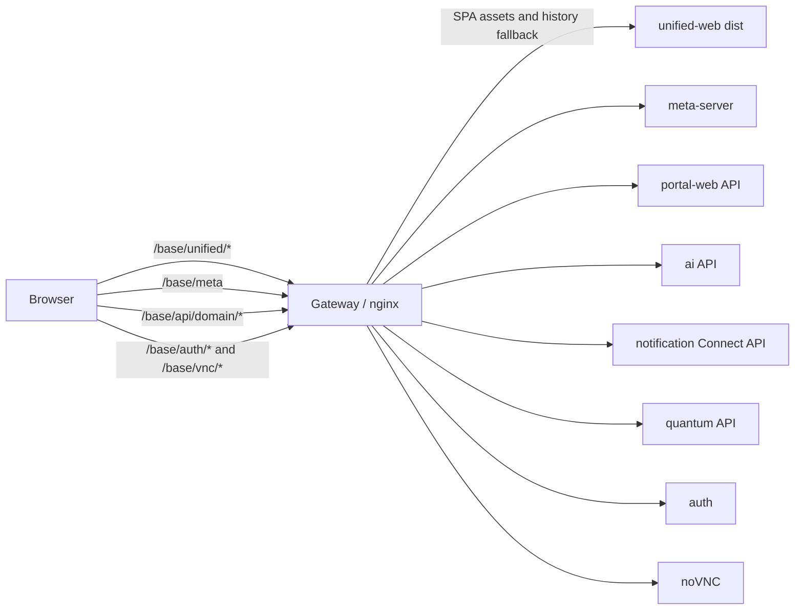

# SCOW Unified Web

`unified-web` 是 SCOW 新一代统一前端。目前它以 `/unified` 作为预览入口，目标是逐步承接 Portal、AI、Notification 和 Quantum 的页面，并在后续阶段整合 MIS 与 Resource。

本文描述当前代码的实际状态，同时给出架构判断和优化路线。完整迁移目标见 [`docs/design/unified-web-migration.md`](../../docs/design/unified-web-migration.md)，当前阶段进度和线上验收项见 [`docs/design/unified-web-migration-status.md`](../../docs/design/unified-web-migration-status.md)。

## 当前结论

整体方向合理，但实现仍处于迁移期，不宜直接视为可全量切换的最终架构。

合理之处包括：

- 使用 Gateway 提供同源静态资源、认证 Cookie 和领域 API，避免为统一 UI 再增加一层 BFF。
- 用 React Router、TanStack Query、Zustand 和 i18next 分别管理路由、服务端状态、少量 UI 状态和语言状态，职责划分清楚。
- Notification 和 Dashboard 都采用 `types -> real/mock client -> queries -> components` 的分层方式，业务组件不感知 mock 分支。
- Dashboard 使用 `Promise.allSettled` 聚合 Portal 与 AI，单个来源失败时仍可展示其他来源的数据，符合统一门户的容错需求。
- Vite 构建路径和 SCOW 全局路径分别处理，能够支持 `/scow/unified` 一类非根路径部署。

当前主要风险是：路由与导航还没有形成真正的模块注册机制；应用启动失败、模块禁用和权限边界缺少统一处理；跨应用 REST 契约大量手写；共享 `libs/web` 的浏览器边界不清晰；测试脚本只有类型检查。详细判断见[架构问题与优化建议](#架构问题与优化建议)。

## 技术栈

| 关注点 | 当前实现 |
| --- | --- |
| 构建与开发 | Vite 8、TypeScript 5.9 |
| UI | React 18、Ant Design 5、styled-components 6 |
| 路由 | React Router 7（声明式 `Routes`） |
| 服务端状态 | TanStack Query 5 |
| 本地 UI 状态 | Zustand 5 |
| 国际化 | i18next、react-i18next、Ant Design locale |
| HTTP/RPC | Axios、Connect-RPC Web |
| 图表 | Recharts |
| 部署 | Gateway 生成 nginx 配置并托管 SPA 静态资源 |

## 运行时拓扑



浏览器只访问 Gateway 的同源地址。Gateway 将 `/api/{domain}` 前缀重写为各旧应用的原始 API 路径，并保留 Cookie、请求体、流式响应和 WebSocket upgrade 所需配置。

生产构建包含两个路径概念：

- `UNIFIED_BASE_PATH`：SPA 自身的公开路径，例如 `/scow/unified`，用于 Vite 静态资源和 React Router `basename`。
- `SCOW_BASE_PATH`：SCOW 整体的公开路径，例如 `/scow`，用于 `/meta`、`/api/*` 等同源请求。

Vite 构建时写入占位符。Gateway 启动时由 `prepareUnifiedWebAssets()` 复制 `dist`，替换占位符，再由 nginx 的 `try_files` 提供 history fallback。

## 浏览器内架构

```mermaid
flowchart TD
  Main[main.tsx] --> QueryProvider[QueryClientProvider]
  QueryProvider --> ThemeProvider[RuntimeThemeProvider]
  ThemeProvider --> Router[BrowserRouter]
  Router --> App[App routes]
  App --> Layout[Global layout / AppLayout]
  Layout --> TopBar[TopBar]
  Layout --> SideNav[SideNavigation]
  Layout --> Poller[NotificationPopupPoller]
  Layout --> Outlet[Route Outlet]

  Outlet --> Feature[Feature page]
  Feature --> Queries[feature queries]
  Queries --> ClientContract[domain client interface]
  ClientContract --> RealClient[realClient]
  ClientContract --> MockClient[mockClient]
  RealClient --> GatewayApi[/api/domain]
```

### 启动流程

1. `main.tsx` 加载全局样式和 i18next，并创建 React 根节点。
2. `QueryClientProvider` 提供统一请求缓存。默认重试一次，窗口重新聚焦时不刷新。
3. `RuntimeThemeProvider` 请求 `/meta`，再从 MIS 获取统一 UI 配置。
4. UI 配置同步页面标题、主色、初始语言和可选语言；Ant Design 与 styled-components 共用派生主题。
5. `BrowserRouter` 使用 Vite `BASE_URL` 计算出的 `basename`，`AppLayout` 渲染顶部栏、侧栏、通知轮询和页面出口。

当前没有独立的 bootstrap gate。元数据和 UI 配置加载期间会先用默认主题渲染；请求失败也没有根级错误页，这一点需要在切换前补齐。

### 状态归属

| 状态类型 | 归属 | 示例 |
| --- | --- | --- |
| 服务端状态 | TanStack Query | metadata、UI 配置、通知、集群概览、快捷入口 |
| URL 状态 | React Router | 当前领域、页面和嵌套路由 |
| 跨页面 UI 状态 | Zustand | 侧栏折叠、移动端 Drawer |
| 语言状态 | i18next | 当前语言、localStorage、Cookie、HTML `lang` |
| 临时组件状态 | React state | 通知分页、Tab、编辑中的订阅配置 |

这个划分应继续保持：不要把 Query 数据复制到 Zustand，也不要用 Context 承载频繁变化的领域状态。

## 目录与边界

```text
apps/unified-web/
├── scripts/                 # i18n 检查脚本
├── src/
│   ├── app/                 # 应用装配、全局布局和路由注册
│   │   ├── layout/          # 顶栏、侧栏及其布局状态
│   │   └── router/          # 模块导航和路由注册信息
│   ├── api/                 # 全局运行元数据、UI 配置和 HTTP 基础能力
│   ├── config/              # 构建/运行时路径与 mock 开关
│   ├── features/
│   │   ├── dashboard/       # 跨 Portal/AI 的仪表盘聚合
│   │   └── notification/    # 通知页面、轮询和 Connect-RPC 适配
│   ├── i18n/                # 语言定义、namespace 和翻译资源
│   ├── mocks/               # 全局启动和配置的 mock 数据
│   ├── pages/               # 路由级组合页面和迁移占位页
│   ├── shared/              # 不依赖上层的跨层公共契约、UI 和工具
│   ├── styles/              # 全局样式
│   └── theme/               # 运行时主题适配
├── index.html
├── package.json
└── vite.config.ts
```

代码保持以下单向依赖：

```text
main -> app
app -> pages / features / shared
pages -> features / shared
features -> shared

feature components -> feature queries -> feature client contract
                                        -> real/mock client
```

- `app` 负责 Provider、路由和全局布局，不承载领域业务。
- `pages` 负责路由参数和 feature 组合，不沉积可复用业务逻辑。
- `features` 按业务能力组织页面、组件、请求与状态。跨 feature 调用只能经过对方 `index.ts` 公共入口，避免依赖内部目录。
- `shared` 不依赖任何上层目录，只保存业务无关的公共契约、UI、配置和工具。
- 不设置全局 `components`、`stores`、`hooks` 收纳目录。布局代码归 `app/layout`，状态放在其所有者附近，共享 UI 归 `shared/ui`。

feature 内文件较少时保持扁平；只有组件或 API 文件数量增加后才建立 `components/`、`api/`、`hooks/` 等子目录。Dashboard 的消息卡片通过 Notification 的公共入口使用查询能力，不直接引用 Notification 内部文件。

## 路由与迁移状态

| 路径 | 当前状态 | 数据来源 |
| --- | --- | --- |
| `/dashboard` | 正在迁移，已有集群概览、快捷入口和通知卡片 | Portal REST + AI REST + Notification |
| `/files/*` | 占位页 | 尚未接入 |
| `/profile` | 已迁移个人信息、修改邮箱和修改密码 | MIS REST |
| `/extensions/*` | 已迁移 UI Extension iframe 页面 | Portal/AI 配置 + 扩展 HTTP API |
| `/portal/jobs`、`/portal/apps` | 占位页 | 尚未接入 |
| `/ai/jobs`、`/ai/assets` | 占位页 | 尚未接入 |
| `/notification/messages` | 已迁移用户消息列表 | Notification Connect-RPC |
| `/notification/subscriptions` | 已迁移用户订阅设置 | Notification Connect-RPC |
| `/quantum/dashboard`、`/quantum/jobs`、`/quantum/devices` | 占位页 | 尚未接入 |
| `/mis/*`、`/resource/*` | 不在当前 SPA 中 | 计划第二阶段迁移 |

`src/app/router/modules.tsx` 当前主要是侧栏描述，不是完整的模块注册表。实际路由仍在 `src/app/App.tsx` 手工组装，Notification 也走单独分支。

## 数据访问模式

### Metadata 与 UI 配置

- `/meta` 返回 SCOW `basePath`、版本和已启用组件。
- 侧栏根据 `metadata.components` 过滤 Portal、AI 和 Quantum。
- UI 配置统一读取 MIS 的 `/getAppInitialConfig`，品牌 Logo 和 favicon 也使用 MIS 接口。
- metadata 与 UI 配置使用无限 `staleTime`，同一会话不主动刷新。
- `AuthenticationGuard` 在布局渲染前检查会话，优先使用 Portal，其次 AI、MIS；明确未登录时跳转对应旧登录入口，请求失败时显示错误态。
- 统一前端专用 API 使用 `/api/unified/{domain}/*`，避免抢占 Portal 的 `/api/notification/*` 等旧接口。

### Dashboard

- `DashboardApi` 是页面面对的统一契约，real client 与 mock client 实现同一接口。
- real client 分别加载 Portal 和 AI 的用户可见集群及概览，并归一化为 `DashboardClusterSummary`。
- 两个来源并行加载。来源级失败记录到 `failedSources`，集群级失败记录到 `failedClusters`。
- 相同 `clusterId` 同时存在时，以 Portal 资源数据为主，并合并 AI 作业数和分区等待作业数。
- Query 每 60 秒刷新一次概览；快捷入口读取和保存使用独立 query/mutation。

### Notification

- `realClient.ts` 使用生成的 Notification protobuf 和 Connect Web client。
- `queries.ts` 统一维护 query key，并在写操作成功后失效 Notification 缓存。
- 顶栏每 60 秒刷新未读数；弹窗消息每 5 分钟轮询。
- 页面通过领域 DTO 隔离 protobuf 消息，模板本地化和渲染集中在 `renderMessage.ts`。

### Profile 与顶部栏

- 顶部品牌 Logo 和 favicon 使用已启用旧系统的 `/logo`、`/icon` API，继续支持配置目录和按域名覆盖。
- 当前用户从 MIS `getAppInitialConfig` 获取；顶部显示用户图标、姓名或 ID，不使用头像占位。
- `/profile` 沿用 MIS 个人信息页的 Descriptions、角色标签、邮箱和密码弹窗样式。
- 修改邮箱、校验密码、修改密码和退出分别调用 `/api/unified/mis/profile/*` 与 `/api/unified/mis/auth/logout`。
- 退出完成后清理根路径 `SCOW_USER` Cookie，并清除 TanStack Query 中的当前用户数据。

### UI Extension

- 从 Portal `getAppInitialConfig.uiExtension` 与 AI `/config.UI_EXTENSION` 聚合扩展配置；同名同 URL 的配置合并为一个扩展实例。
- manifest 保持旧版 `portal`、`ai`、`mis` 字段，本阶段只调用已迁移的 Portal/AI 协议，不新增 `unified` 字段。
- 顶部链接支持 priority、远程图标、自动刷新和新页面打开；链接较多时沿用旧版逻辑只显示图标。
- Portal/AI 侧栏分别调用 `rewriteNavigations`，支持新增、删除、重排、嵌套、外部链接和旧版 `svgIcon`。
- `/extensions/*` iframe 仅通过查询参数传递 `scowDark` 和 `scowLangId`；统一前端从 MIS 当前会话读取用户 token，仅用于调用扩展配置接口，Portal/AI 仅提供扩展配置来源，并处理旧版高度、标题、刷新与退出消息。
- 扩展 HTTP API 由浏览器直接跨域调用，扩展服务必须允许统一前端来源的 CORS GET/POST 和 `Content-Type: application/json` 预检。

### Mock

设置 `VITE_USE_MOCK=1` 后，client loader 动态加载 mock 实现。组件和 queries 不应出现 `USE_MOCK` 判断。新增领域时应继续使用同一模式，并确保 real/mock client 通过同一组契约测试。

## 国际化与主题

- 每个领域使用独立 namespace；`zh_cn` 是基准语言，调用 `t()` 时应提供中文 default value。
- 当前声明支持九种语言；Profile 已复制旧版九种语言文本，其他领域目前主要只有简体中文和英文，其余语言继续依赖 fallback。
- 语言变化会同步到 i18next、Ant Design locale、localStorage、Cookie 和 HTML `lang`。
- 主题色支持默认色、暗色主色和 hostname 映射。
- 当前“主题”按钮尚无行为，Ant Design dark algorithm 和 styled-components 暗色 token 也未接入，因此暗色模式仍是不完整能力。

## 本地开发

首次开发先在仓库根目录准备生成代码和共享库：

```bash
pnpm install
pnpm prepareDev
```

在本目录启动开发服务器：

```bash
pnpm dev
```

默认地址为 `http://localhost:3000`，默认将 `/api`、`/auth`、`/meta` 和 `/vnc` 代理到 `http://localhost:80`。
开发代理会把认证 callback URL 改为浏览器请求的 Host，使远端认证完成后仍回跳当前本地开发地址。
与所选 Gateway 同源的 UI Extension API 会通过本地 `/__gateway__` 前缀转发，使本地登录 Cookie 可用于扩展鉴权。

可用环境变量：

| 变量 | 默认值 | 用途 |
| --- | --- | --- |
| `VITE_GATEWAY_URL` | `http://localhost:80` | Vite 开发代理的 Gateway 地址 |
| `VITE_SCOW_BASE_PATH` | 空 | 开发环境中的 SCOW 全局 basePath |
| `VITE_USE_MOCK` | 空 | 设为 `1` 或 `true` 时使用 mock client |

常用检查：

```bash
pnpm test          # Jest；当前尚无测试文件，允许空测试集
pnpm typecheck     # TypeScript 类型检查
pnpm build         # 类型检查并执行 Vite 生产构建
pnpm i18n:check    # 翻译扫描、default value 和资源状态检查
```

## 新增或迁移领域功能

1. 在 `src/features/{domain}` 定义页面所需的领域 DTO 和 client 接口，不要让组件直接依赖 Axios response 或 protobuf message。
2. 分别实现 `realClient.ts` 和 `mockClient.ts`，由 `client.ts` 根据 `USE_MOCK` 动态加载。
3. 在 `queries.ts` 集中定义 query key、query 和 mutation；写操作后精确失效相关缓存。
4. 页面只调用 query hooks。筛选、分页等可分享状态优先放入 URL，短暂编辑状态留在组件内。
5. 在模块注册表中声明路由、导航、启用条件和权限；在模块入口做路由级 lazy loading。
6. 先更新 `zh_cn`，再补齐其他启用语言，并运行 `pnpm i18n:check`。
7. 至少为 adapter/聚合逻辑添加单元测试，为关键页面添加组件测试，并覆盖一条真实 Gateway 的端到端链路。

## 架构问题与优化建议

### P0：全量切换前必须解决

#### 1. 模块注册、导航和路由存在双重事实来源

现状：`routes/modules.tsx` 只描述部分导航；`App.tsx` 另行注册 Dashboard、Files、Notification 和模块占位路由。metadata 只过滤菜单，不阻止直接访问已禁用模块；用户权限过滤也尚未实现。

风险：领域增多后容易出现“菜单没有但路由可访问”“路由已迁移但导航遗漏”或 lazy loading 不一致。前端隐藏不能替代后端鉴权，但缺少前端 guard 会产生错误请求和错误体验。

建议：定义单一 `AppModule` 契约，至少包含 `id`、`basePath`、`enabled(metadata)`、`canAccess(session)`、`navigation` 和 lazy `routes`。由同一注册表同时生成路由和导航，并提供统一的 disabled/forbidden/not-found 页面。平台级的 Dashboard、Files 也作为 platform module 注册。

#### 2. 缺少应用启动门和根级错误边界

现状：metadata 未返回时，侧栏和通知默认按“启用”处理；metadata 或 UI 配置失败时没有明确错误态；没有 React error boundary；Notification 的 lazy fallback 是空白。生产环境既未启用 Portal 也未启用 AI 时，UI 配置会静默使用 mock 配置。

风险：网络故障、会话失效或配置错误会表现为闪烁、空白、错误菜单和后台重复请求，难以区分“系统未启用”和“请求失败”。

建议：增加 `AppBootstrap`，显式建模 `loading / ready / unauthenticated / unavailable / misconfigured`；metadata 成功后再启动依赖模块的轮询。为根路由和每个 lazy module 增加错误边界及可见 skeleton。无 Portal/AI 时应由平台级配置端点返回全局 UI 配置，不能回落到 mock。

#### 3. 缺少可防回归的测试体系

现状：`pnpm test` 使用 Jest，但 `unified-web` 下还没有单元、组件或端到端测试；`pnpm typecheck` 单独执行 TypeScript 检查。Dashboard 聚合、跨来源同名集群、通知缓存失效、路由/basePath 都依赖人工验证。

建议：

- 单元测试：Dashboard adapter/aggregate、i18n 文本归一化、runtime path、query key。
- 契约测试：同一用例同时运行 real client 的响应 mapper 和 mock client，避免 mock 与生产行为漂移。
- 组件测试：模块禁用、请求失败、部分集群失败、权限和移动导航。
- 端到端测试：自定义 basePath 下的深层路由刷新、登录 Cookie、上传下载、SSE 和 WebSocket。

同时将 `test` 改为真正的测试命令，把类型检查拆成 `typecheck`，避免 CI 名称造成错误信号。

#### 4. 迁移完成度不足

Files、Portal、AI 和 Quantum 仍是占位内容，TopBar 的主题切换尚未接通；个人信息和退出登录已经完成。这个问题不是技术选型错误，但意味着当前应用只能作为预览和渐进迁移载体，不能作为旧 UI 的等价替代。

建议按“完整纵向切片”迁移：每次完成一个页面的路由、权限、API、loading/error/empty 状态、i18n、测试和 Gateway 验证，再标记完成，避免积累大量只能导航的占位页。

### P1：迁移过程中应尽快解决

#### 5. 跨应用 API 契约手写且 adapter 过重

Dashboard `realClient.ts` 同时负责 Portal/AI 请求、权限推导、响应类型、归一化、冲突合并和快捷入口保存。多个 REST response interface 是前端手写的，服务端变更无法自动触发编译失败，也没有运行时校验。

建议将其拆为 `portalAdapter`、`aiAdapter` 和纯函数 `mergeDashboardData`；优先复用现有类型安全路由或生成契约。无法生成的 REST 响应在网络边界做 schema 校验，并将协议错误转换为统一领域错误。合并规则应有独立测试和明确注释，尤其是重复 `clusterId`、分区不一致和显示模式冲突。

#### 6. 共享 Web 库泄漏构建内部和 Next.js 依赖

当前 Dashboard 从 `@scow/lib-web/build/components/quickEntry` 导入。`build/*` 是包内部产物路径，`libs/web` 本身还带有 Next.js、simstate、nookies 等旧前端依赖。

建议为 `@scow/lib-web` 增加明确的 package exports，例如浏览器安全的 `@scow/lib-web/quick-entry`；将纯 React UI、Next adapter 和旧应用状态适配拆开。`unified-web` 只依赖浏览器安全入口，Vite 配置不应长期通过 `optimizeDeps.include` 修补内部路径。

#### 7. 请求基础设施不统一

虽然存在 `createRestClient()`，Dashboard 又自行创建 Axios 实例；当前没有统一错误模型、401 行为、trace id、超时策略或 AbortSignal 传递。随着文件、作业和流式功能迁入，这会形成大量重复处理。

建议建立轻量 transport 工厂，统一 basePath、credentials、错误转换和可观测字段；query function 接收并下传 `signal`。下载、上传、SSE、Connect-RPC 和 WebSocket 保持各自原生 transport，不要为了表面统一强行包成 Axios。

#### 8. 主题和国际化能力对外暴露早于实现

主题按钮目前无效，暗色模式只影响主色选择而没有切换 Ant Design algorithm 和完整 styled token。七种语言在全局界面使用的 `common` namespace 中只有空资源，启用后主要依赖英文/中文 fallback。

建议在能力完整前隐藏无效控制；主题状态应明确由服务端默认值、系统偏好和用户选择共同解析，并由一个 token 源同时生成 Ant Design 与 styled-components 主题。语言菜单应区分“系统允许”和“当前 SPA 资源已就绪”，迁移完成后再取消 fallback 依赖。

#### 9. 构建与运行时配置还需加固

根 `turbo.json` 的 `build.outputs` 只声明 `.next/**` 和 `build/**`，没有包含 Vite 的 `dist/**`。这会使 Turbo 对 unified-web 的缓存和产物跟踪不准确。Gateway 目前递归扫描 CSS、HTML、JS、JSON 并做字符串占位符替换，产物结构变化时存在漏替换或误替换风险。

建议增加 `@scow/unified-web#build` 的 `dist/**` 输出声明；将运行时值收敛到明确的 `runtime-config.js` 或受控 manifest，并只对必要入口做替换。为自定义 basePath、动态 import chunk、静态资源和 history fallback 增加 Gateway 集成测试。

#### 10. 首屏 bundle 已超过合理基线

本次分析时的生产构建中，主入口约为 1.93 MB（gzip 约 576 KB），已经触发 Vite 的 500 KB chunk 警告。Notification 已做路由级 lazy loading，但 Dashboard 仍由 `App.tsx` 同步导入，图表和共享快捷入口等依赖会进入首屏链路。

建议所有领域模块统一使用路由级 lazy loading，优先延迟 Recharts、文件编辑器和其他重型组件；用 bundle analyzer 确认重复依赖和 `libs/web` 带入的旧前端代码。CI 应记录入口及各领域 chunk 的 gzip 预算，避免迁移页面时持续放大首屏成本。手工拆 vendor chunk 只能改善缓存，不能替代按页面减少首屏依赖。

### P2：规模扩大前持续治理

- 将每个领域的 route entry 放回 `features/{domain}`，`src/pages` 只保留平台级页面，避免页面与 feature 边界漂移。
- 给 query key 建立领域工厂，并规范分页、筛选和轮询参数；不要把无关 metadata 对象整体放入 key。
- 增加统一的日志、前端错误上报和版本信息，错误报告应包含 SCOW 版本、unified-web 版本、模块和 route。
- 定期检查 bundle：领域模块必须路由级拆包，重型编辑器、图表和文件功能按页面加载。
- 在迁移完成前记录旧页面能力清单和验收矩阵，防止只迁移可见 UI 而遗漏下载、SSE、WebSocket、权限或异常流程。

## 推荐实施顺序

1. **稳定基础设施**：补齐 bootstrap/error boundary、单一模块注册表、真正的测试命令和 Turbo `dist` 输出。
2. **固化领域模板**：以 Notification 为样板，统一 contract、real/mock client、query、route entry 和测试结构。
3. **拆分 Dashboard adapter**：锁定 Portal/AI 合并规则，并补齐部分失败、重复集群和权限测试。
4. **按纵向切片迁移页面**：UI Extension -> Portal/AI 核心页面 -> Quantum，每个切片同时完成权限、错误态和 API 验证；Files 等待用户的文件功能重构合入后再迁移。
5. **收紧共享边界**：提供 `libs/web` 浏览器 exports，逐步消除 `build/*` 深层导入和 Next.js 依赖泄漏。
6. **切换前端到端验收**：覆盖自定义 basePath、深层刷新、认证、上传下载、SSE、WebSocket 和旧 MIS 共存。

由于 Gateway 和开发代理包含 `/vnc` 与 WebSocket 转发，任何涉及这些路径、nginx、镜像或 URL 生成的变更都必须重点验证 noVNC 页面打开、静态资源加载、WebSocket/VNC 建连，以及实际连接到已有桌面；无法覆盖时应在自测说明中记录原因。

## 架构决策边界

以下选择目前没有必要改变：

- 保持纯 SPA，不引入 SSR。
- 保持 Gateway 作为唯一公开 HTTP 聚合入口，不新增统一 BFF。
- 领域内部继续使用适合自身的 REST、tRPC 或 Connect-RPC，不为了协议一致而重写服务。
- TanStack Query 管服务端状态，Zustand 只管必要的本地跨页面状态。
- 迁移期保留旧 UI 作为 API 上游，完成验收后再统一切换和清理。

优化重点应放在模块契约、错误与权限边界、可验证性和共享包边界，而不是更换框架或增加新的全局状态方案。
