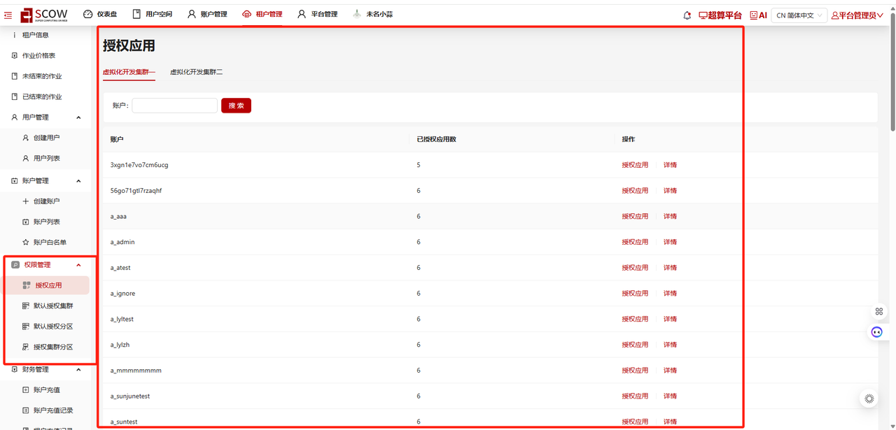
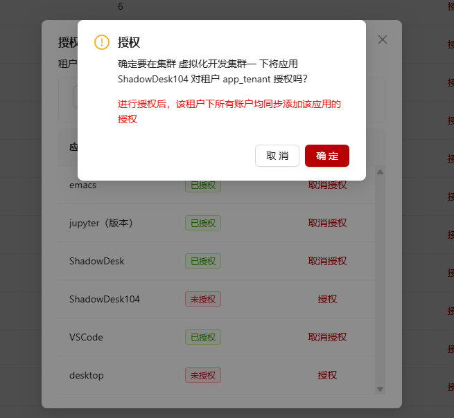
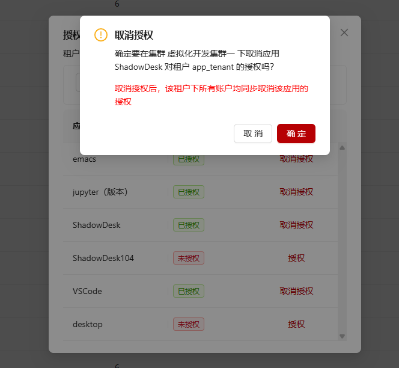
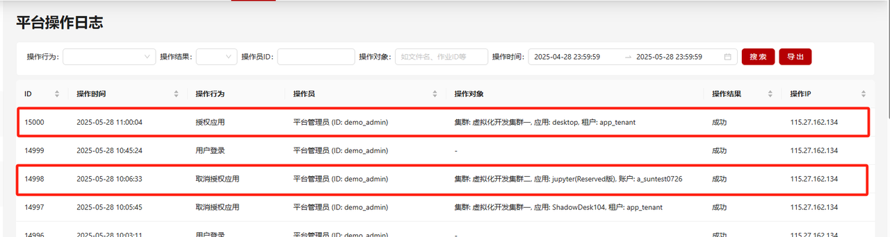
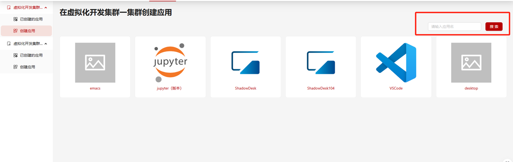

# 授权交互式应用

在部署了管理系统的前提下，系统支持提供给管理员开启或关闭授权交互式应用的功能。

管理员可以通过在`config/common.yaml`下增加的可选配置`allowAppAuthorization`来自定义是否开启或关闭授权交互式应用的功能，默认为开启。

配置：

```yaml title="config/common.yaml"

# 在 管理系统/超算平台/AI系统 中是否支持授权交互式应用功能
# 布尔值，默认为true，不配置时表示开启
allowAppAuthorization: true

```

# 授权交互式应用开启后示例

## 管理系统

当授权交互式应用功能被开启后，在管理系统中可以实现为**租户**和**账户**授权或取消授权集群下交互式应用的功能。



- 在导航项**平台管理-权限管理-授权应用**下，支持**平台管理员**在当前启用中的集群，对**租户**授权或取消授权集群下的交互式应用。

- 在导航项**租户管理-权限管理-授权应用**下，支持**租户管理员**在当前启用中的集群（如开启资源管理服务，则为启用中且已被授权的集群）下，对**本租户下的账户**授权或取消授权已授权给该租户的交互式应用。

- 在导航项**租户管理-权限管理-默认授权应用**下，支持**租户管理员**在当前启用中的集群（如开启资源管理服务，则为启用中且已被授权的集群）下，设定默认授权应用。更新默认授权应用时，会同步修改本租户下**所有账户**的授权应用信息。

- **创建新租户**时，会将所有交互式应用默认授权给新创建的租户，但是不会添加到租户的默认授权应用中。租户管理员可以自行手动添加该应用为默认授权应用。

- **创建新账户**或通过导入用户功能**导入新账户**时，会将所属租户的默认授权应用自动授权给新创建的账户。

- 在**为租户授权交互式应用**时， 表示该应用可以被选择设置为默认授权应用，也表示该应用可以被选择授权给账户。



- 在**为租户取消授权交互式应用**时，如果该应用为租户的默认授权应用，会同步移出；也会同步取消该应用在租户下账户的授权。



- **为租户添加默认授权交互式应用**时，会同步将该应用的授权添加给租户下的账户。
- **移出租户的默认授权交互式应用**时，会同步取消该应用在租户下账户的授权。

- 在操作日志中，追加授权应用、取消授权应用、添加默认授权应用、移出默认授权应用的操作行为。


## 超算平台 或 AI

当授权交互式应用功能被开启后，在**超算平台**或**AI系统**中将按照用户所属账户已被授权的交互式应用进行展示及验证。

- 在**创建应用**页面只展示用户关联的账户已被授权的交互式应用。



- 在通过交互式应用提交作业时，所选账户在当前系统可用账户的逻辑以外，还需满足为当前应用已授权的账户。

- 用户不可以在某账户下提交未授权给该账户的交互式应用的作业。


