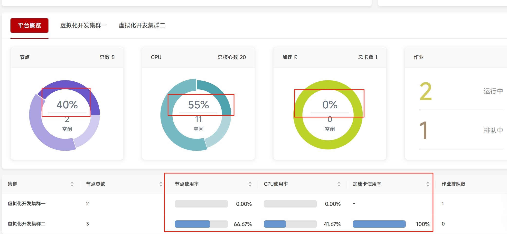

# 仪表盘普通用户显示模式

在超算平台和智算平台的仪表盘中，系统支持管理员选择给普通用户展示显示内容模式的功能。

管理员可以通过在`config/common.yaml`下增加的可选配置`dashboard.userDisplayMode`来定义给普通用户的显示内容模式，默认为`full`完整模式。

配置：

```yaml title="config/common.yaml"

# 仪表盘配置
dashboard:
  # 普通用户的显示模式。
  # 可选值：full: 完整模式，显示所有资源数据（已用、空闲、不可用）；simplified: 简化模式，只显示节点总数、运行中的作业数等基本信息
  userDisplayMode: "simplified"

```

## 仪表盘普通用户显示模式示例


### 超算平台 或 智算平台

当普通用户的显示模式被设置后，在**超算平台**或**智算平台**中将按照用户拥有的权限和系统管理员的配置，展示不同的仪表盘内容。

- 在默认状态以及设置userDisplayMode为`full`时，对所有用户展示仪表盘的完整内容。

- 当设置userDisplayMode为`simplified`时，如果用户不是平台管理员或者租户管理员，即视为普通用户。

- 对普通用户隐藏红色框出来的部分。



- 完全的数据展示，包括已用，空闲，不可用；对普通用户仅部分数据展示，仅包括已用，空闲

